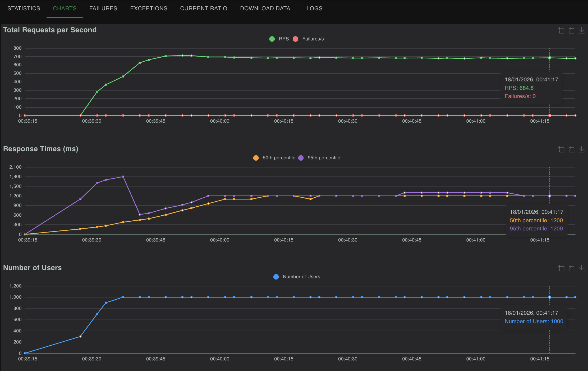

# entity-api

Continuous batching API for encoder models (Token Classification / NER) using Flash Attention 2/3.

## Overview

- Custom Attention Interface using Flash Attention 3 (FA3) optimized for Hopper GPUs, with FA2 fallback for Ampere
- Dynamic batching using varlen ragged tensor style (no padding!)
- Encoder model doesn't need KV Cache, so straight forward to implement
- BPE token merging for word-level entity extraction
- Regex extraction for IC, phone, email

### Folder Structure

```
app/
├── __init__.py              # Package init
├── main.py                  # Entry point (FastAPI app)
├── env.py                   # Config/args parsing
├── core/
│   ├── __init__.py
│   ├── attention.py         # FA3/FA2 registration, version detection
│   ├── model.py             # Model loading
│   └── batch_processor.py   # Dynamic batch queue (cu_seqlens)
├── utils/
│   ├── __init__.py
│   ├── text.py              # BPE token merging
│   └── patterns.py          # Regex patterns, label mappings
└── api/
    ├── __init__.py
    └── routes.py            # FastAPI endpoints (/predict, /health)
```

## How to Install

```bash
git clone https://github.com/malaysia-ai/entity-api && cd entity-api
```

```bash
uv venv --python 3.10
source .venv/bin/activate
uv pip install -r requirements.txt
```

## How to Run Locally

### Run scicom-intl/multilingual-dynamic-entity-decoder

```
CUDA_VISIBLE_DEVICES=0 python3 -m app.main --host 0.0.0.0 --port 8000
```

### Supported Parameters

```bash
python3 -m app.main --help
```

```text
usage: main.py [-h] [--host HOST] [--port PORT] [--model MODEL] [--loglevel LOGLEVEL]
               [--max_batch_size MAX_BATCH_SIZE] [--max_seq_len MAX_SEQ_LEN]
               [--microsleep MICROSLEEP] [--memory_utilization MEMORY_UTILIZATION]
               [--torch_dtype {float16,bfloat16,float32}]

Configuration parser

options:
  -h, --help            show this help message and exit
  --host HOST           host name to host the app (default: 0.0.0.0)
  --port PORT           port to host the app (default: 8000)
  --model MODEL         Model type (default: Scicom-intl/multilingual-dynamic-entity-decoder)
  --loglevel LOGLEVEL   Logging level (default: INFO)
  --max_batch_size MAX_BATCH_SIZE
                        Maximum batch size for dynamic batching (default: 32)
  --max_seq_len MAX_SEQ_LEN
                        Maximum sequence length (default: 512)
  --microsleep MICROSLEEP
                        Sleep time between batch processing (default: 0.001)
  --memory_utilization MEMORY_UTILIZATION
                        GPU memory utilization (default: 0.9)
  --torch_dtype {float16,bfloat16,float32}
                        Torch dtype for computation (default: bfloat16)
```

### Supported Model

- [scicom-intl/multilingual-dynamic-entity-decoder](https://huggingface.co/Scicom-intl/multilingual-dynamic-entity-decoder)

## Simple API Example

```bash
curl -X POST http://localhost:8000/predict \
  -H "Content-Type: application/json" \
  -d '{"text": "nama saya Ahmad dari Kuala Lumpur, IC 900101-01-0101, hubungi 0123456789 atau email ahmad@test.com"}'
```

Output:

```json
{
  "text": "nama saya Ahmad dari Kuala Lumpur, IC 900101-01-0101, hubungi 0123456789 atau email ahmad@test.com",
  "masked_text": "nama saya <name> dari Kuala Lumpur, IC <ic>, hubungi <phone> atau email <email>",
  "name": ["Ahmad"],
  "address": [],
  "ic": ["900101-01-0101"],
  "phone": ["0123456789"],
  "email": ["ahmad@test.com"]
}
```

### Debug Mode

Set `debug_mode: true` to see raw encoder model output (token-level predictions):

```bash
curl -X POST http://localhost:8000/predict \
  -H "Content-Type: application/json" \
  -d '{"text": "nama saya Ahmad", "debug_mode": true}'
```

Output:

```json
{
  "text": "nama saya Ahmad",
  "masked_text": "nama <name>",
  "name": ["saya Ahmad"],
  "address": [],
  "ic": [],
  "phone": [],
  "email": [],
  "encoder_output": [
    {"word": "nama", "label": "O"},
    {"word": "saya", "label": "name"},
    {"word": "Ahmad", "label": "name"}
  ]
}
```

## Unit Tests

```bash
python3 -m unittest test.test_varlen_batching
python3 -m unittest test.test_bpe_merging
python3 -m unittest test.test_regex_entities
python3 -m unittest test.test_attention
```

**Test Coverage:**
- `test_varlen_batching` - Variable length sequence packing and FlashInfer ragged prefill
- `test_bpe_merging` - BPE token merging for GPT-style and SentencePiece tokens
- `test_regex_entities` - IC, phone, and email extraction via regex patterns
- `test_attention` - Non-causal attention correctness comparing FlashInfer with SDPA

## Stress Test

```bash
locust -f stress_test.py -H http://localhost:8000 --web-port 7001
```

### Results

RPS maintained at **684 req/s**, better compared to FlashInfer which achieved 501 req/s.



## Benchmark

```bash
python3 benchmark.py --endpoint predict --save benchmark --concurrency-list "10,50,100,200"
```

### Results

GPU: NVIDIA A10G, Flash Attention 2 (FA2)

| Concurrency | Avg Response Time | P50 | P95 | Throughput |
|-------------|-------------------|-----|-----|------------|
| 10 | 1416.6ms | 1378.1ms | 1632.2ms | 7.1 req/s |
| 50 | 2513.1ms | 2534.4ms | 3582.4ms | 19.9 req/s |
| 100 | 3738.4ms | 3850.7ms | 5763.9ms | 26.7 req/s |
| 200 | 6137.4ms | 6031.6ms | 10327.3ms | 32.6 req/s |

Peak throughput: **32.6 req/s** at 200 concurrency on A10G GPU.
